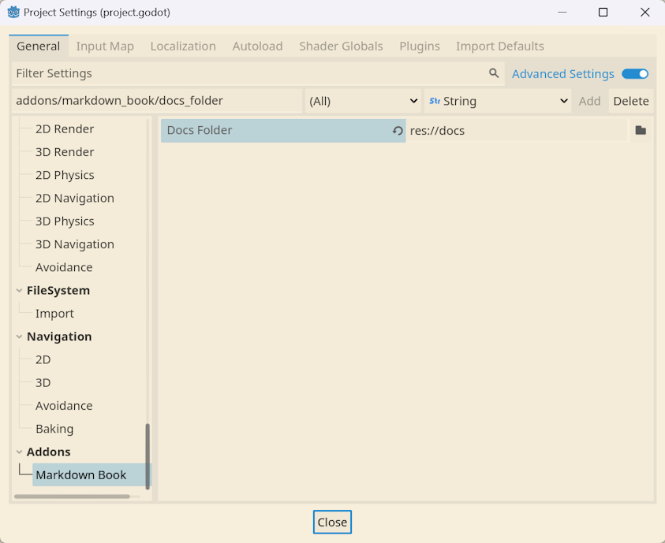

# Markdown Book - Godot Addon

This addon lets you write custom documentation and view it in Godot.

The addon uses the same hierarchy as mdbook.
If you follow the mdbook guide, it should work.

Markdown support may be limited due to Godot BBCode support.

## Installation

1. Download the addon from GitHub or AssetLib.
2. Copy the addons folder into your project if you download it from GitHub.
3. Download the addon MarkdownLabel from daenvil.
4. Enable both addons in your project settings.
5. Reload the project if needed.
6. You will see a new button alongside the AssetLib button.

7. Set the path to the documentation folder in the Project Avanced Settings (Addons > Markdown Book > Docs Folder)

8. Reload the project if needed.

## Roadmap

- [ ] Create the rich text markdown inside the addon
- [ ] Create a dark theme icon
- [ ] Make the tree reload when clicking on the docs folder

## License

This project is licensed under the terms of the [Mozilla Public License, version 2.0](https://www.mozilla.org/en-US/MPL/2.0/).

The icon (./addons/markdown_viewer/icon.svg and ./icon.png) is licensed under the terms of the [CC BY-NC-ND](https://creativecommons.org/licenses/by-nc-nd/4.0/) License.

## Thanks

- Daenvil for creating the MarkdownLabel addon
